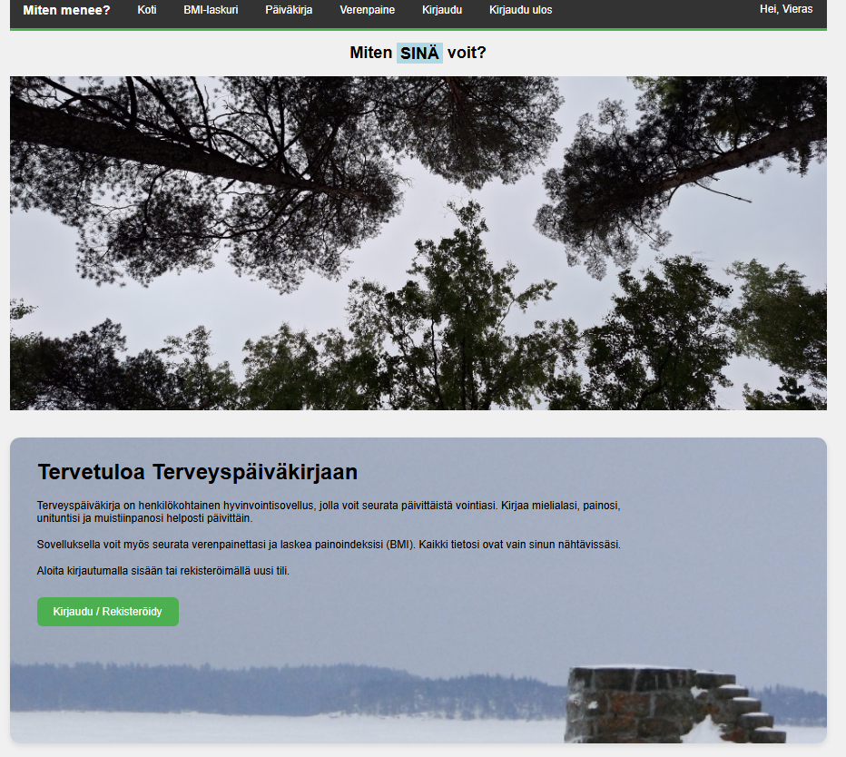
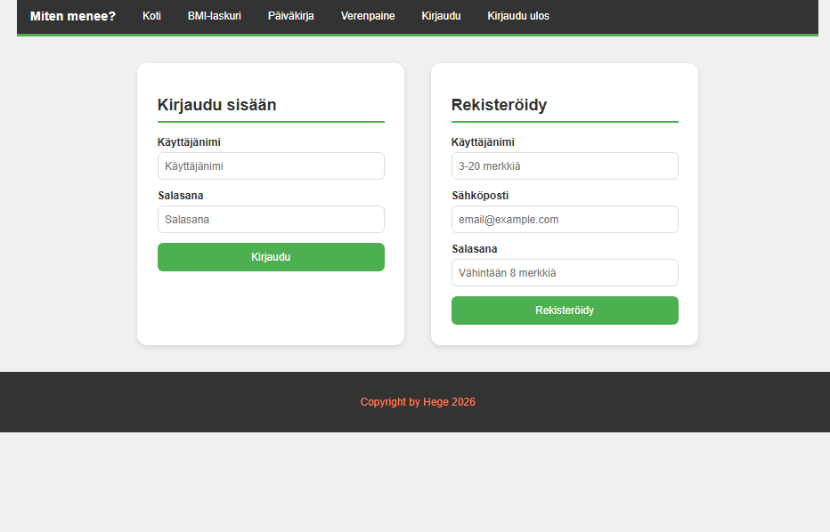
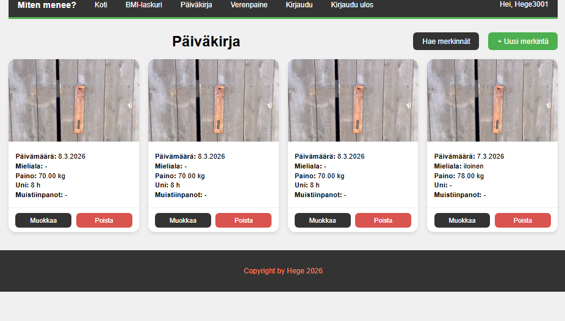
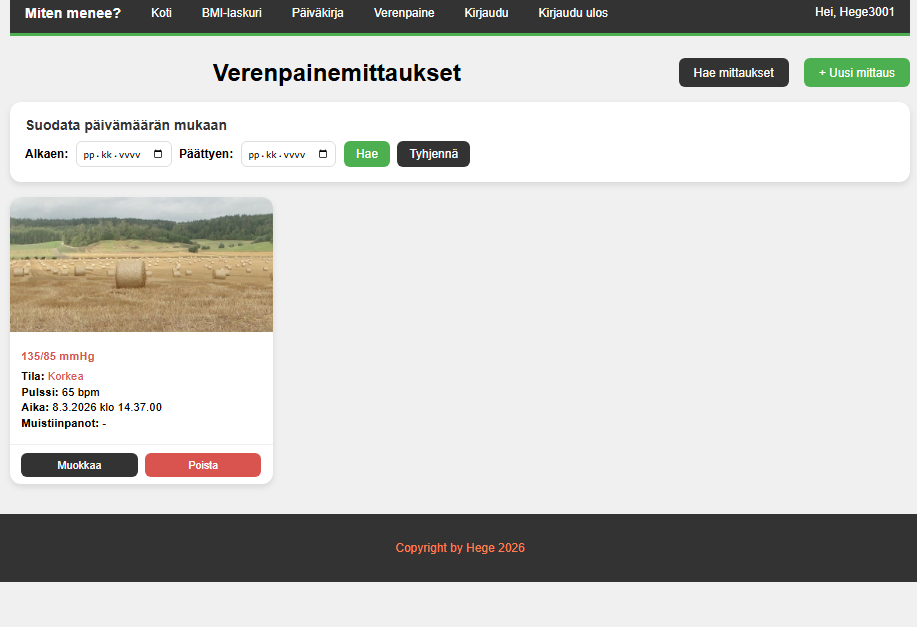
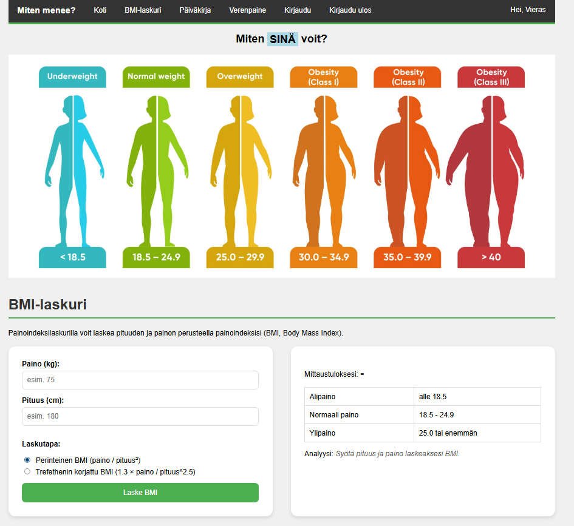

# Terveyspäiväkirja — Health Diary Web App

Yksilöprojekti | Web-sovelluskehitys TX00EY11-3003

Terveyspäiväkirja on full stack -web-sovellus, jossa käyttäjä voi seurata terveyttään kirjaamalla päiväkirjamerkintöjä, verenpainemittauksia sekä laskemalla BMI-arvonsa. Sovellus on toteutettu Node.js/Express-backendillä ja Vite-pohjaisella HTML/CSS/JS-frontendillä.

---

## Ominaisuudet

- **Rekisteröityminen ja kirjautuminen** — JWT-pohjainen autentikaatio
- **Päiväkirja** — merkintöjen lisäys, muokkaus, poisto ja selaus korttinäkymässä
- **Verenpaine** — mittaustulosten CRUD ja päivämääräsuodatus
- **BMI-laskuri** — perinteinen kaava sekä Trefethenin korjattu kaava automaattisella tulkinnalla
- **Tietoturva** — käyttäjä näkee ja muokkaa vain omia tietojaan
- **Responsiivinen ulkoasu** — mobiili- ja työpöytänäkymä, omat grafiikat ja taustat

---

## Tietokannan rakenne

```sql
Users
  user_id     INT PRIMARY KEY AUTO_INCREMENT
  username    VARCHAR UNIQUE NOT NULL
  password    VARCHAR NOT NULL          -- bcrypt-hash
  email       VARCHAR UNIQUE NOT NULL
  user_level  ENUM('admin','regular')

DiaryEntries
  entry_id    INT PRIMARY KEY AUTO_INCREMENT
  user_id     INT FOREIGN KEY -> Users
  entry_date  DATE
  mood        VARCHAR
  weight      DECIMAL
  sleep_hours DECIMAL
  notes       TEXT

BloodPressure
  bp_id       INT PRIMARY KEY AUTO_INCREMENT
  user_id     INT FOREIGN KEY -> Users
  systolic    INT
  diastolic   INT
  pulse       INT
  measured_at DATETIME
```

---

## Kuvakaappaukset







---

## Tekninen arkkitehtuuri

### Backend

| Kerros | Tiedostot |
|--------|-----------|
| Routes | `entry-router.js`, `bloodpressure-router.js`, `user-router.js` |
| Controllers | `entry-controller.js`, `bloodpressure-controller.js`, `user-controller.js` |
| Models | `entry-model.js`, `bloodpressure-model.js`, `user-model.js` |
| Middlewares | `authentication.js` (JWT), `logger.js` |
| Utils | `database.js` (mysql2-pool) |

**Teknologiat:** Node.js (ESM), Express.js, MariaDB/MySQL, bcryptjs, jsonwebtoken, express-validator

### Frontend

| Sivu | Kuvaus |
|------|--------|
| `index.html` | Etusivu |
| `login.html` | Kirjautuminen ja rekisteröityminen |
| `paivakirja.html` | Päiväkirjamerkintöjen CRUD, korttinäkymä |
| `verenpaine.html` | Verenpainemittausten CRUD ja suodatus |
| `bmi.html` | BMI-laskuri (perinteinen + Trefethen) |

**Teknologiat:** Vite (multi-page build), Vanilla JS (ESM), CSS (Flexbox, CSS-muuttujat, mediakyselyt)

---

## API-endpointit

```
POST   /api/users/login             Kirjautuminen, palauttaa JWT-tokenin
POST   /api/users                   Rekisteröityminen

GET    /api/entries                 Omat päiväkirjamerkinnät
POST   /api/entries                 Uusi merkintä
GET    /api/entries/:id             Yksittäinen merkintä
PUT    /api/entries/:id             Päivitä merkintä
DELETE /api/entries/:id             Poista merkintä

GET    /api/bloodpressure           Verenpainemittaukset (+ päivämääräsuodatus)
POST   /api/bloodpressure           Uusi mittaus
GET    /api/bloodpressure/:id       Yksittäinen mittaus
PUT    /api/bloodpressure/:id       Päivitä mittaus
DELETE /api/bloodpressure/:id       Poista mittaus
```

Kaikki suojatut reitit vaativat otsikossa: `Authorization: Bearer <token>`

---

## Asennus ja käynnistys

### Backend

```bash
cd BE
npm install
cp .env.sample .env
# Täytä .env: DB_HOST, DB_USER, DB_PASSWORD, DB_NAME, JWT_SECRET
npm run dev
```

### Frontend

```bash
cd FE
npm install
npm run dev       # kehityspalvelin
npm run build     # tuotantobuild -> dist/
```

### Tietokanta

```bash
mysql -u käyttäjä -p tietokanta < db/health-diary-db.sql
```

---

## Julkaisu (users.metropolia.fi)

Frontend on julkaistu Metropolian palvelimella. Backend käynnistetään paikallisesti esittelytilaisuudessa:

```bash
cd BE && npm run dev
```
## Ohjelmistotestaus

### Tehtävä 1 — Asennukset
Asensin Robot Frameworkin ja sen lisäosat virtuaaliympäristöön.

### Tehtävä 2 — Kirjautumistesti
Tein kirjautumistestin omalle sovellukselle. Testi tarkistaa onnistuneen ja epäonnistuneen kirjautumisen.
- [login_test.robot](tests/front/login_test.robot)
- [Lokitiedosto](outputs/log.html)
- [Raportti](outputs/report.html)

### Tehtävä 3 — Web form -testi
Testasin Selenium Web Form -sivun kenttiä.
- [webform_test.robot](tests/front/webform_test.robot)

### Tehtävä 4 — Päiväkirjamerkinnän lisääminen
Testi kirjautuu sovellukseen ja lisää uuden päiväkirjamerkinnän.
- [entry_test.robot](tests/front/entry_test.robot)

### Tehtävä 5 — .env-tiedosto
Käyttäjätunnus ja salasana piilotettu .env-tiedostoon.
- [login_test.robot](tests/front/login_test.robot)

### Tehtävä 6 — CryptoLibrary
Käyttäjätunnus ja salasana salattu CryptoLibraryllä.
- [crypto_login_test.robot](tests/front/crypto_login_test.robot)

### Tehtävä 7 — Tulostiedostot
Testien loki- ja raporttitiedostot ohjattu outputs/-kansioon.

### Tehtävä 8 — GitHub Pages
Testiraportit nähtävissä GitHub Pages -sivustolla.
- [Lokitiedosto](https://Hege3000.github.io/frontend-vite/outputs/log.html)
- [Raportti](https://Hege3000.github.io/frontend-vite/outputs/report.html)

### Tehtävä 9 — Taustapalvelimen testaus
Testasin backendin API-endpointteja RequestsLibraryllä.
- [api_test.robot](tests/back/api_test.robot)


## Testausraportit

- [Lokitiedosto](outputs/log.html)
- [Raportti](outputs/report.html)
---

## Käytetyt lähteet ja AI:n hyödyntäminen

### Lähteet

- [Express.js dokumentaatio](https://expressjs.com/)
- [Vite dokumentaatio](https://vitejs.dev/)
- [express-validator](https://express-validator.github.io/)
- [jsonwebtoken](https://github.com/auth64/node-jsonwebtoken)
- [bcryptjs](https://github.com/dcodeIO/bcrypt.js)
- [MDN Web Docs — Fetch API](https://developer.mozilla.org/en-US/docs/Web/API/Fetch_API)
- [MDN Web Docs — CSS Flexbox](https://developer.mozilla.org/en-US/docs/Web/CSS/CSS_flexible_box_layout)
- Trefethenin BMI-kaava: [Nick Trefethen, Oxford (2013)](https://people.maths.ox.ac.uk/trefethen/bmi.html)

### AI:n hyödyntäminen

Projektissa on hyödynnetty tekoälyä (Claude, Anthropic ja ChatGPT) seuraavissa kohdissa:

- Backend-rakenne ja MVC-arkkitehtuurin suunnittelu
- Express-validator-validointisääntöjen kirjoittaminen
- Frontend-komponenttien (kortit, snackbar, dialog) toteutus
- BMI-laskurin Trefethen-kaavan implementointi
- vite.config.js multi-page-konfiguraatio
- README.md:n kirjoittaminen

**Koodikommenteissa** AI:n tuottamat tai sen avulla kirjoitetut osuudet on merkitty kommentilla `// AI-assisted`.

Opiskelija on tarkistanut, ymmärtää ja osaa selittää kaiken koodissa olevan logiikan.

---

## Linkit

- 🌐 Julkaistu sovellus: https://users.metropolia.fi/~henrijja/HYTE-kevat-26/Frontend/
- 📁 Frontend-repo: https://github.com/Hege3000/frontend-vite/tree/week8-palautus
- 📁 Backend-repo: https://github.com/Hege3000/backend/tree/week8-palautus
